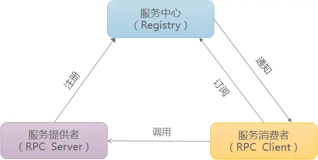

## RPC框架
### RPC架构组成

- 服务提供者（RPC Server），运行在服务器端，提供服务接口定义与服务实现类。
- 服务中心（Registry），运行在服务器端，负责将本地服务发布成远程服务，管理远程服务，提供给服务消费者使用。
- 服务消费者（RPC Client），运行在客户端，通过远程代理对象调用远程服务。  

服务提供者启动后主动向服务（注册）中心注册机器ip、端口以及提供的服务列表； 服务消费者启动时向服务（注册）中心获取服务提供方地址列表，可实现软负载均衡和Failover。
### RPC调用流程
#### RPC架构组件
1、 客户端(RPC Client)：服务调用方  
2、 客户端存根(Client Stub)：存放服务端地址信息，将客户端的请求参数打包成网络消息，再通过网络发送给服务方  
3、 服务端存根(Server Stub)：接受客户端发送过来的消息并解包，再调用本地服务  
4、 服务端(RPC Server)：真正的服务提供者。  
#### 调用流程
1)、服务消费方（Client）调用以本地调用方式调用服务；  
2)、Client stub接收到调用后负责将方法、参数等组装成能够进行网络传输的消息体；  
3)、Client stub找到服务地址，通过Socket将消息发送到服务端；  
4)、Server stub收到消息后进行解码；  
5)、Server stub根据解码结果调用服务端本地的服务；  
6)、本地服务执行并将结果返回给Server stub；  
7)、Server stub将返回结果打包成消息;  
8)、Server stub通过Socket将消息发送至客户端；  
9)、Client stub接收到消息，并进行解码；  
10)、服务消费方（RPC Client）得到最终的服务调用结果。  
RPC框架的目标就是要2~9这些步骤都封装起来，让用户对这些细节透明。
***
### RPC框架代码实现（模仿篇）
#### ToDo(zookeeper引入)


***
### 学习过程
（1）[maven项目中，多模块之间如何相互引用](https://blog.csdn.net/weixin_52145067/article/details/125284126)  
（2）Java 并发学习
> [一文秒懂 Java ExecutorService](https://www.twle.cn/c/yufei/javatm/javatm-basic-executorservice.html)
>> - 需求场景？
>>> 线程池，方便管理线程的使用。
>> - 是什么？
>>> ExecutorService 会自动提供一个线程池和相关 API，用于为其分配任务。
>> - 怎么用？
>>> - 实例化
>>>> ThreadPoolExecutor类实现了ExecutorService 接口并提供了一些构造函数用于配置执行程序服务及其内部池。  
>>>>
>>>>```java
>>>> // 线程池参数
>>>> int corePoolSize = 10; // 线程池中的核心线程数为10，即最少保持的线程数。
>>>> int maximumPoolSizeSize = 100; // 线程池中允许的最大线程数为100，当核心线程都在工作，而任务队列又已满时，允许创建新的线程来处理任务，直到线程数达到最大值。
>>>> long keepAliveTime = 1; // 非核心线程的空闲线程存活时间为1分钟。即当线程池中的线程数大于核心线程数时，空闲线程在等待新任务时，最多保持1分钟，超过这个时间就会被销毁。
>>>> BlockingQueue<Runnable> workQueue = new ArrayBlockingQueue<>(100); // 线程池中的任务队列为ArrayBlockingQueue，容量为100，即允许存放100个任务。
>>>> ThreadFactory threadFactory = Executors.defaultThreadFactory(); // 使用默认的线程工厂Executors.defaultThreadFactory()。
>>>> this.threadPool = new ThreadPoolExecutor(
>>>>        corePoolSize, // 线程池中的核心线程数
>>>>        maximumPoolSizeSize, // 线程池中允许的最大线程数为100，当核心线程都在工作，而任务队列又已满时，允许创建新的线程来处理任务，直到线程数达到最大值。
>>>>        keepAliveTime, // 非核心线程的空闲线程存活时间为1分钟。即当线程池中的线程数大于核心线程数时，空闲线程在等待新任务时，最多保持1分钟，超过这个时间就会被销毁。
>>>>        TimeUnit.MINUTES, // 单位
>>>>        workQueue, // 线程池中的任务队列为ArrayBlockingQueue，容量为100，即允许存放100个任务。
>>>>        threadFactory); // 使用默认的线程工厂Executors.defaultThreadFactory()。
>>>> ```
（3）ZooKeeper 学习使用
> 是什么？
>> ZooKeeper is a centralized service for ***maintaining configuration information***, naming, providing distributed synchronization, and providing group services. All of these kinds of services are used in some form or another by distributed applications. Each time they are implemented there is a lot of work that goes into fixing the bugs and race conditions that are inevitable. ***Because of the difficulty of implementing these kinds of services, applications initially usually skimp on them***, which make them brittle in the presence of change and difficult to manage. Even when done correctly, different implementations of these services lead to management complexity when the applications are deployed.  
>>
> 怎么使用？
>> (1) 三种端口号：三个ZooKeeper配置需要的端口号 
>> - 端口X：客户端连接ZooKeeper集群使用的监听端口号
>> - 端口Y：leader和follower之间数据同步使用的端口号
>> - 端口Z：leader选举专用的端口号  
>> 设置过程如下：[参考文章](https://juejin.cn/s/zookeeper%E9%85%8D%E7%BD%AEip)   
>> 不过目前对端口X的修改的尝试不成功，当前只使用默认的客户端监听端口 2181，后期有时间再研究这个问题  
>>
>> (2)[查询zookeeper注册中心的注册服务](https://cloud.tencent.com/developer/article/1017357)
>